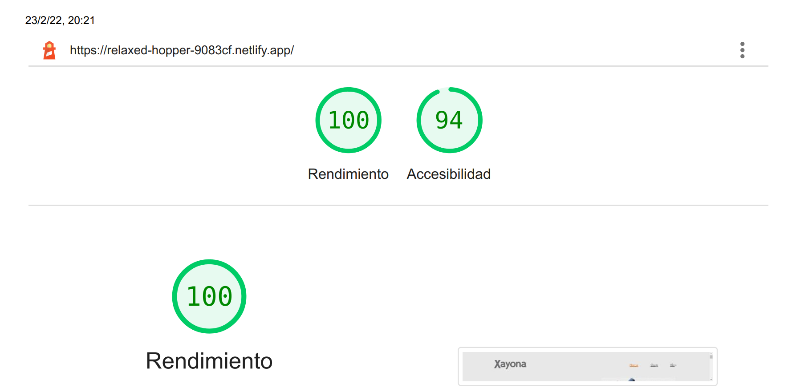
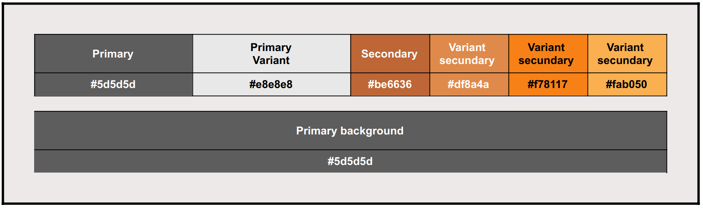

# p5-pc5-ux-vue

## Project setup
```
npm install
```

### Compiles and hot-reloads for development
```
npm run serve
```

### Compiles and minifies for production
```
npm run build
```

### Lints and fixes files
```
npm run lint
```

### Customize configuration
See [Configuration Reference](https://cli.vuejs.org/config/).

### Enlace a Netlify
[Enlace de netlify](https://relaxed-hopper-9083cf.netlify.app/)

### Lighthouse

[lighthouse From Page PDF](doc/lighthouse.pdf)

### Uso de paleta de colores


### Principios de la experiencia del usuario
- Uso del contraste suficiente en colores
- Uso de links destacados

### Técnicas de Accesibilidad
- Uso de ``aria-label`` para fines de enlace
- Uso de ``aria-describedby`` para proporcionar descripciones de imágenes
- Uso de ``aria-required`` para identificar un campo obligatorio
- Uso de ``aria-labelledby`` para proporcionar un nombre para los controles de la interfaz de usuario
- Uso de ``h1-h6`` para identificar encabezados

### Extras
- Imágenes en los productos.